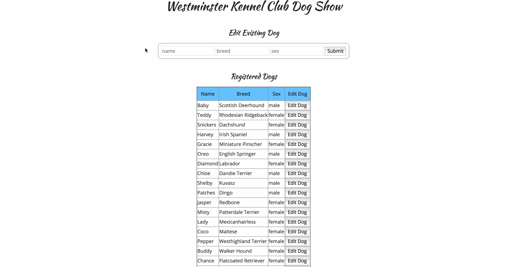

# Westminster Kennel Club Dog Show

You are responsible for managing the website for the Westminster Kennel Club Dog Show. These dog owners are _very_ competitive. We need to make sure that they can view all the competition (the other dogs) and edit their dog's information.

### Getting Started

You will be using the [json-server](https://github.com/typicode/json-server) package to mock an external API. You can make the same RESTful requests to this server that you would to any API. If you haven't yet, install json-server.
```bash
npm install -g json-server
```

Then run the server with:
```bash
json-server --watch db.json
```

This will serve your code on http://localhost:3000.

### Deliverables

- On page load, render a list of already registered dogs in the table. You can fetch these dogs from http://localhost:3000/dogs.
- The dog should be put on the table as a table row. The HTML might look something like this `<tr><td>Dog *Name*</td> <td>*Dog Breed*</td> <td>*Dog Sex*</td> <td><button>Edit</button></td></tr>`
- Make a dog editable. Clicking on the edit button next to a dog should populate the top form with that dog's current information.
- On submit of the form, a PATCH request should be made to http://localhost:3000/dogs/:id to update the dog information (including name, breed and sex attributes).
- Once the form is submitted, the table should reflect the updated dog information. There are many ways to do this. You could search for the table fields you need to edit and update each of them in turn, but we suggest making a new get request for all dogs and rerendering all of them in the table. Make sure this GET happens after the PATCH so you can get the most up-to-date dog information.

### Example
The below gif demonstrates the working functionality of the app.



